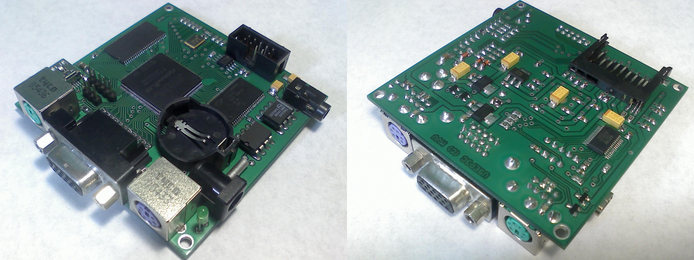

# ReVerSE-U9
Development Kit

 
Платформа ориентированна на создание SoC систем на микросхеме программируемой логики ПЛИС. Отлично подходит для домашнего обучения и позволяет полностью воссоздать множество ретро-компьютеров.

Схема реализуемого устройства задается прошивкой, записываемой в статическую память микросхемы ПЛИС. Микросхема ПЛИС представляет собой массив логических элементов, таким образом, существует возможность исправления ошибок схемы, а также добавления новых устройств, с помощью перепрошивки ПЛИС (выполняемой средствами самого устройства, либо через USB-кабель). 

Системы-на-кристалле потребляют меньше энергии, стоят дешевле и работают надёжнее, чем наборы микросхем с той же функциональностью. В отличие от обычных цифровых микросхем, логика работы ПЛИС не определяется при изготовлении, а задаётся посредством программирования (проектирования).

Для программирования используются программаторы и отладочные среды, позволяющие задать желаемую структуру цифрового устройства в виде принципиальной электрической схемы или программы на специальных языках описания аппаратуры: Verilog, VHDL, AHDL и др. В конфигурации ПЛИС реализуются почти все компоненты компьютера. Вне ПЛИС находятся только оперативная память, аппаратные интерфейсы для подключения клавиатуры, мыши, монитора, и других устройств.

#### Спецификация:
- FPGA Altera Cyclone® III EP3C10E144C8N (supports Cyclone® III EP3C5)
- SDRAM 32MB x 8 bit (supports 8 MB/16 MB/32 MB x 8 bit)
- SRAM 512KB х 8 bit
- SPI FLASH 4 Mb (supports 1/4/16/64 Mb)
- Dual 16-bit I2S DAC TDA1543
- RTC PCF8583 + CR2032
- VGA 15-pin RGB(3:3:3)
- SD cart
- Connector 3-pin
- Connector 5-pin
- Audio out 3.5 mm
- miniUSB (USB-UART & CBUS-JTAG)
- JTAG (CBUS-JTAG)
- PS/2 keyboard/mouse
- PS/2 moude/keyboard
- Power DC +5V 500 mA
- PCB Size 75 х 75 mm

#### Вид платы:

