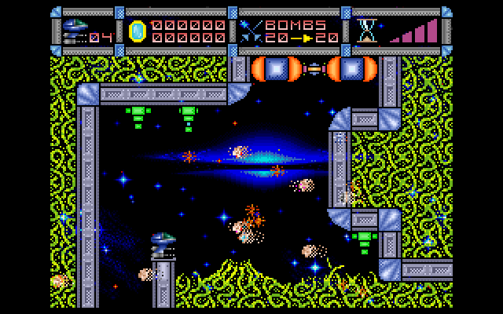

#### SPEC256

SPEC256: http://www.emulatronia.com/emusdaqui/spec256/download-eng.htm

игры: http://www.emulatronia.com/emusdaqui/spec256/download-eng.htm

редактор: http://kolmck.net/apps/EmuZ/EmuZWin_Rus.htm

SPIFLASH 512KB -> 8MB

- CPU: T80_GFX @ 3.5MHz
- RAM: 48K
- ROM: 16K ('82)
- VGA: 256x192 GFX256/Std (ZX Spectrum 48K)
- HDMI: 576P @ 49Hz
- Sound: Port 0xFE (Beeper)
- F1 Joystick on/off
- F2 = режим 256c
- F5 = MENU для загрузки игр
- F6 = Layer on/off
- Joystick: Kempston
- Games: Lode Runner, Cybernoid II, Cybernoid, Solomon's Key, Aquaplane